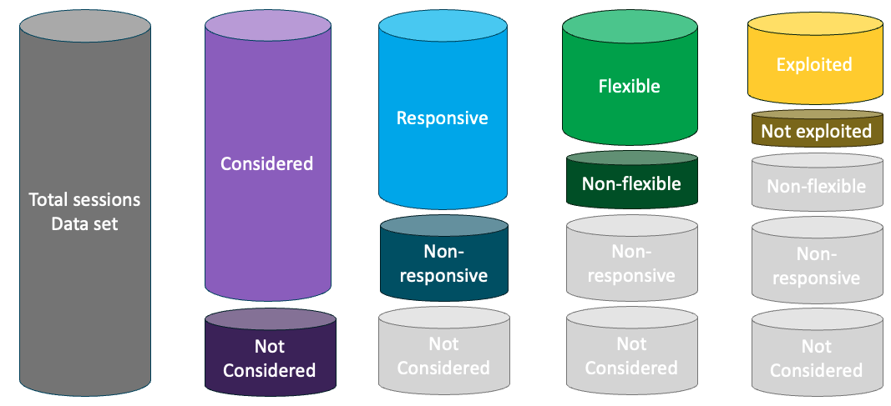

# Smart charging

The smart charging concept is widely used in different fields and
applications. In `flextools` package, we define *smart charging* as a
tool to coordinate individual EV charging sessions in order to obtain
the optimal aggregated demand profile according to a certain objective.
There are different **scheduling methods** to coordinate each session,
such as:

- **Postpone**: shifting charging start time over time
- **Interrupt**: stop charging during certain time
- **Curtail**: limiting charging power during certain time

At the same time, the charging sessions can be coordinated with
different objectives or goals, such as minimizing the interaction with
the power grid, minimizing the energy cost, participating in flexibility
or imbalance markets, not surpassing grid constraints or capacity
limits, accomplishing with demand-response programs, etc.

The function
[`smart_charging()`](https://resourcefully-dev.github.io/flextools/reference/smart_charging.md)
aims to provide a framework to simulate any of these situations to
analyze the impact and benefits of electric vehicle flexibility.

## Smart charging algorithm

We have divided the smart charging algorithm contained inside
[`smart_charging()`](https://resourcefully-dev.github.io/flextools/reference/smart_charging.md)
function in two different stages:

1.  Setpoint calculation for the aggregated EV demand curve
2.  Scheduling of the individual sessions to match the setpoint of the
    aggregated demand

Below, we will briefly explain the process performed in each one of
theses steps.

### Setpoint calculation

The *setpoint* for the aggregated EV demand is understood as the
desired, optimal or allowed power demand, depending on the objective and
characteristics of the control over the charging points.

Currently, `flextools` allows the following methods to define the
setpoint of the aggregated EV demand:

- Setpoint as **maxium EV demand**: a maximum EV demand capacity profile
  can be configured as a constrain to coordinate charging sessions below
  the limits. This must be set for every EV user profile in the charging
  sessions data set.

- Setpoint as **optimal EV demand**: the optinal EV demand is calculated
  based on a Quadratic programming optimization to minimize the
  interaction with the power grid (see [Net power
  optimization](https://resourcefully-dev.github.io/flextools/articles/minimize_net_power.html)),
  the energy cost (see [Energy cost
  optimization](https://resourcefully-dev.github.io/flextools/articles/minimize_cost.html))
  or both (see [Combined
  optimization](https://resourcefully-dev.github.io/flextools/articles/combined_optimization.html)),
  setting the parameter `opt_objective` accordingly. Internally, the
  [`smart_charging()`](https://resourcefully-dev.github.io/flextools/reference/smart_charging.md)
  function is making use of the
  [`optimize_demand()`](https://resourcefully-dev.github.io/flextools/reference/optimize_demand.md)
  function internally, using parameters `direction="forward"` to
  postpone EV sessions and `time_horizon=NULL` to exploit their
  flexibility until the end of the optimization window.

### Scheduling algorithm

The scheduling method is defined by the parameter `method` in the
[`smart_charging()`](https://resourcefully-dev.github.io/flextools/reference/smart_charging.md)
function, which can be `"postpone"`, `"curtail"`, `"interrupt"` or
`"none"`. If `method = "none"`, the sessions schedule is not modified
and the calculated setpoints are returned as a optimal results. If
`method` is different than `"none"`, after obtaining the setpoint
$`O_t`$ (i.e. optimal load), the scheduling algorithm follows the
sequence below for every time slot $`t`$:

1.  Calculate $`LF_t`$, the EV demand (i.e. flexible load)

2.  Get the time slots where $`LF_t > O_t`$

3.  Stop if no more flexibility is required

4.  For every time slot where $`LF_t > O_t`$

    4.1. Get the power difference between load and setpoint in the time
    slots where $`LF_t > O_t`$

    4.2. Select flexible sessions (see definition below) and set a
    priority order

    4.3. Go to next time slot if no more flexibility is available

    4.4. Coordinate flexible sessions to match the setpoint

5.  Stop if no more flexibility is available

6.  Return the new schedule of EV sessions

To classify a connected EV as a **flexible session** or not, the
`flextools` package defines the following conditions according to smart
charging method used:

- **Postpone**: the EV has not started charging yet, and the energy
  required can be charged during the rest of the connection time at the
  nominal charging power. From all flexible sessions in a time slot, the
  ones connecting earlier will have priority over the later sessions.
- **Interrupt**: the charge is not completed yet, and the energy
  required can be charged during the rest of the connection time at the
  nominal charging power. From all flexible sessions in a time slot, the
  ones that have been charging during less time will have priority over
  the sessions that have been already charging (rotation system).
- **Curtai**l: the charge is not completed yet or will not be completed
  in the current time slot, and the energy required can be charged
  during the rest of the connection time at a lower power than the
  nominal charging power.

The energy and power constraints of these conditions can also be defined
in function
[`smart_charging()`](https://resourcefully-dev.github.io/flextools/reference/smart_charging.md)
with the parameters `energy_min` and `charging_power_min`, representing
the minimum allowed ratios of the nominal values. More information about
using these parameters can be found in article [Advanced smart
charging](https://resourcefully-dev.github.io/flextools/articles/smart-charging-advanced.html).

## Smart charging examples

Below, some examples of
[`smart_charging()`](https://resourcefully-dev.github.io/flextools/reference/smart_charging.md)
are illustrated for both the **grid congestion simulation**, where we
set a maximum EV capacity to not surpass, and the **optimization
simulation**, where the net power usage or/and the energy cost are
optimized thanks to smart charging.

For the smart charging examples that require optimizing the EV demand, a
building demand, a solar PV production and energy prices are obtained
from the example `energy_profiles` object provided by `flextools`:

    ## # A tibble: 6 × 7
    ##   datetime            solar building price_imported price_exported price_turn_up
    ##   <dttm>              <dbl>    <dbl>          <dbl>          <dbl>         <dbl>
    ## 1 2023-05-01 00:00:00     0     3.06         0.0999          0.025        0.104 
    ## 2 2023-05-01 00:15:00     0     2.98         0.0999          0.025        0.0993
    ## 3 2023-05-01 00:30:00     0     2.90         0.0999          0.025        0     
    ## 4 2023-05-01 00:45:00     0     2.82         0.0999          0.025        0     
    ## 5 2023-05-01 01:00:00     0     2.74         0.0955          0.025        0     
    ## 6 2023-05-01 01:15:00     0     2.64         0.0955          0.025        0     
    ## # ℹ 1 more variable: price_turn_down <dbl>

On top of these energy variables, we can simulate some charging sessions
using the `evsim` package, which provides the function
[`evsim::get_custom_ev_model`](https://resourcefully-dev.github.io/evsim/reference/get_custom_ev_model.html)
to create a custom EV model to later simulate EV sessions with
[`evsim::simulate_sessions()`](https://resourcefully-dev.github.io/evsim/reference/simulate_sessions.html)
function.

We can create an EV model with custom time-cycles and user profiles. In
this case, we will consider just one EV user profile (see the [EV user
profile
concept](https://resourcefully-dev.github.io/evprof/articles/evprof.html)
from package `evprof`), “HomeEV”, which will represent a
“charge-at-home” pattern starting in average at 18:00 until next
morning.

Once we have our own model, we simulate 5 sessions per day of our user
profile called “HomeEV”, charging at 3.7 kW, during the first 3 days of
the `energy_data` and with a resolution of 15 minutes:

| Session | Timecycle | Profile | ConnectionStartDateTime | ConnectionEndDateTime | ChargingStartDateTime | ChargingEndDateTime | Power | Energy | ConnectionHours | ChargingHours |
|:---|:---|:---|:---|:---|:---|:---|---:|---:|---:|---:|
| S1 | Workdays | HomeEV | 2023-05-01 13:45:00 | 2023-05-02 03:46:00 | 2023-05-01 13:45:00 | 2023-05-01 18:20:00 | 3.7 | 17.02 | 14.02 | 4.60 |
| S2 | Workdays | HomeEV | 2023-05-01 14:00:00 | 2023-05-02 04:33:00 | 2023-05-01 14:00:00 | 2023-05-01 17:06:00 | 3.7 | 11.47 | 14.55 | 3.10 |
| S3 | Workdays | HomeEV | 2023-05-01 14:15:00 | 2023-05-02 03:01:00 | 2023-05-01 14:15:00 | 2023-05-01 17:42:00 | 3.7 | 12.80 | 12.77 | 3.46 |
| S4 | Workdays | HomeEV | 2023-05-01 17:30:00 | 2023-05-02 07:09:00 | 2023-05-01 17:30:00 | 2023-05-01 21:45:00 | 3.7 | 15.76 | 13.65 | 4.26 |
| S5 | Workdays | HomeEV | 2023-05-01 21:45:00 | 2023-05-02 11:47:00 | 2023-05-01 21:45:00 | 2023-05-02 01:40:00 | 3.7 | 14.54 | 14.03 | 3.93 |
| S6 | Workdays | HomeEV | 2023-05-02 10:15:00 | 2023-05-02 23:13:00 | 2023-05-02 10:15:00 | 2023-05-02 15:01:00 | 3.7 | 17.65 | 12.97 | 4.77 |
| S7 | Workdays | HomeEV | 2023-05-02 17:45:00 | 2023-05-03 05:54:00 | 2023-05-02 17:45:00 | 2023-05-02 21:36:00 | 3.7 | 14.28 | 12.15 | 3.86 |
| S8 | Workdays | HomeEV | 2023-05-02 19:30:00 | 2023-05-03 09:18:00 | 2023-05-02 19:30:00 | 2023-05-02 23:16:00 | 3.7 | 13.99 | 13.80 | 3.78 |
| S9 | Workdays | HomeEV | 2023-05-02 22:45:00 | 2023-05-03 10:30:00 | 2023-05-02 22:45:00 | 2023-05-03 03:28:00 | 3.7 | 17.50 | 11.75 | 4.73 |
| S10 | Workdays | HomeEV | 2023-05-02 23:45:00 | 2023-05-03 13:37:00 | 2023-05-02 23:45:00 | 2023-05-03 04:11:00 | 3.7 | 16.43 | 13.87 | 4.44 |
| S11 | Workdays | HomeEV | 2023-05-03 11:45:00 | 2023-05-04 02:00:00 | 2023-05-03 11:45:00 | 2023-05-03 14:40:00 | 3.7 | 10.80 | 14.25 | 2.92 |
| S12 | Workdays | HomeEV | 2023-05-03 18:00:00 | 2023-05-04 10:15:00 | 2023-05-03 18:00:00 | 2023-05-03 21:47:00 | 3.7 | 14.02 | 16.25 | 3.79 |
| S13 | Workdays | HomeEV | 2023-05-03 18:30:00 | 2023-05-04 07:48:00 | 2023-05-03 18:30:00 | 2023-05-03 22:49:00 | 3.7 | 15.98 | 13.30 | 4.32 |
| S14 | Workdays | HomeEV | 2023-05-03 20:45:00 | 2023-05-04 10:00:00 | 2023-05-03 20:45:00 | 2023-05-04 01:08:00 | 3.7 | 16.24 | 13.25 | 4.39 |
| S15 | Workdays | HomeEV | 2023-05-03 23:00:00 | 2023-05-04 13:15:00 | 2023-05-03 23:00:00 | 2023-05-04 02:51:00 | 3.7 | 14.25 | 14.25 | 3.85 |

Finally we can calculate the time-series power demand from each EV with
function
[`evsim::get_demand()`](https://resourcefully-dev.github.io/evsim/reference/get_demand.html),
using parameter `by="Sessions"`:

It is visible that these EV users tend to coincide during the evening
peak hours while, if they were coordinated, they could make a more
efficient usage of the power grid. Following, you will find some
examples about how to coordinate these EV sessions using
[`smart_charging()`](https://resourcefully-dev.github.io/flextools/reference/smart_charging.md)
but first of all let’s start with a minimal example.

Let’s simulate smart charging with:

- Optimization objective “grid” (minimizing interaction with the grid)
- Scheduling method “curtail” (reducing charging power when required)
- no contextual data for optimization (`opt_data` will be just a date
  time sequence)
- optimization window: starting at 6:00AM and with a length of 1 day
  (24h)

The object returned by function
[`smart_charging()`](https://resourcefully-dev.github.io/flextools/reference/smart_charging.md)
is always list with 3 more objects:

    ## [1] "sessions"  "setpoints" "demand"    "log"

- **setpoints**: time-series data frame with the optimal setpoints of
  the EV demand
- **sessions**: coordinated EV sessions’ data frame according to the
  setpoint
- **log**: list with messages about the smart charging algorithm
  (flexibility needs and availability, sessions modified, etc.). This is
  empty by default and filled with messages when `include_log = TRUE`.

Moreover, if we print the results we see a summary of the charging
sessions that have been participating in the smart charging program,
differentiating them between *Considered*, *Responsive*, *Flexible* and
*Exploited*:

    ## Smart charging results as a list of 3 objects: charging sessions, user profiles setpoints and log messages.
    ## Simulation from 2023-05-01 to 2023-05-05 with a time resolution of 15 minutes.
    ## For this time period, there were 3 smart charging windows, where:
    ##   - 15 sessions were considered ( 100 % of total data set).
    ##   - 15 sessions were Responsive ( 100 % of considered sessions).
    ##   - 15 sessions were Flexible ( 100 % of responsive sessions).
    ##   - 15 sessions were Exploited ( 100 % of flexible sessions).

This classification is done by the smart charging algorithm according to
the optimization window hours, the `method` and the sessions’ features:

- **Considered**: charging sessions that charge within the optimization
  windows and are not considered outliers (their connection times fit
  the 95% percentile).
- **Responsive**: charging sessions that accept to participate in the
  smart charging program. The ratio of responsive sessions from every EV
  user profile is configured with the `responsive` parameter.
- **Flexible**: charging sessions that are flexible in a specific time
  slot. This depends on the session’s features and the scheduling
  `method` (as described in the [Scheduling
  algorithm](https://resourcefully-dev.github.io/flextools/articles/smart-charging.html#scheduling-algorithm)
  section).
- **Exploited**: charging sessions that have been modified in a a
  specific time slot.

The following figure illustrates the classification of sessions
according to smart charging program participation:

Also note that after applying the smart charging, the `sessions` object
from the results has more rows than the original `sessions` object. It
is not the number of total charging sessions that has increased, but
**all flexible sessions have been divided in multiple time slots**. This
allows to modify the charging power of every time slot to 0 (postpone or
interrupt methods) or between 0 and the nominal power (curtail method).

In the following example you can see how `Session` “S1” has a different
`Power` value in different time slots:

| Session | ConnectionStartDateTime | ConnectionEndDateTime | ChargingStartDateTime | ChargingEndDateTime | Power | Energy | ConnectionHours | ChargingHours | Timecycle | Profile | Responsive | Flexible | Exploited | EnergyToCharge | ConnectionHoursLeft |
|:---|:---|:---|:---|:---|---:|---:|---:|---:|:---|:---|:---|:---|:---|---:|---:|
| S1 | 2023-05-01 13:45:00 | 2023-05-01 14:00:00 | 2023-05-01 13:45:00 | 2023-05-01 14:00:00 | 3.70 | 0.92 | 0.25 | 0.25 | Workdays | HomeEV | TRUE | TRUE | FALSE | 17.02 | 14.02 |
| S1 | 2023-05-01 14:00:00 | 2023-05-01 14:15:00 | 2023-05-01 14:00:00 | 2023-05-01 14:15:00 | 2.21 | 0.55 | 0.25 | 0.25 | Workdays | HomeEV | TRUE | TRUE | TRUE | 16.09 | 13.77 |
| S1 | 2023-05-01 14:15:00 | 2023-05-01 17:30:00 | 2023-05-01 14:15:00 | 2023-05-01 17:30:00 | 1.47 | 4.79 | 3.25 | 3.25 | Workdays | HomeEV | TRUE | TRUE | TRUE | 15.54 | 13.52 |
| S1 | 2023-05-01 17:30:00 | 2023-05-01 21:45:00 | 2023-05-01 17:30:00 | 2023-05-01 21:45:00 | 1.10 | 4.70 | 4.25 | 4.25 | Workdays | HomeEV | TRUE | TRUE | TRUE | 10.75 | 10.27 |
| S1 | 2023-05-01 21:45:00 | 2023-05-01 22:30:00 | 2023-05-01 21:45:00 | 2023-05-01 22:30:00 | 0.88 | 0.66 | 0.75 | 0.75 | Workdays | HomeEV | TRUE | TRUE | TRUE | 6.06 | 6.02 |
| S1 | 2023-05-01 22:30:00 | 2023-05-01 22:45:00 | 2023-05-01 22:30:00 | 2023-05-01 22:45:00 | 0.91 | 0.23 | 0.25 | 0.25 | Workdays | HomeEV | TRUE | TRUE | TRUE | 5.39 | 5.27 |

Coordinated charging sessions

Then, the `setpoints` object from the result is a tibble that represents
the objective EV demand and the power profile that the algorithm tried
to match while scheduling the EV sessions:

    ## # A tibble: 6 × 2
    ##   datetime            HomeEV
    ##   <dttm>               <dbl>
    ## 1 2023-05-01 00:00:00      0
    ## 2 2023-05-01 00:15:00      0
    ## 3 2023-05-01 00:30:00      0
    ## 4 2023-05-01 00:45:00      0
    ## 5 2023-05-01 01:00:00      0
    ## 6 2023-05-01 01:15:00      0

We can visualise the setpoint on top to the EV demand to see how the
optimal EV demand is different to the original demand:

We can visualize the difference between the defined setpoint and the
final EV user profile by applying the native
[`plot()`](https://rdrr.io/r/graphics/plot.default.html) function to the
[`smart_charging()`](https://resourcefully-dev.github.io/flextools/reference/smart_charging.md)
results, which is equivalent to use the function
[`plot_smart_charging()`](https://resourcefully-dev.github.io/flextools/reference/plot_smart_charging.md).
Moreover, to see the difference between the flexible and the original EV
demand, we can pass the `sessions` parameter to the
[`plot()`](https://rdrr.io/r/graphics/plot.default.html) function.

In this case, we see that at the end of the optimization window we have
some peaks because the EVs have to charge their energy requirements
before the end of the window. For methods to solve this issue see the
section “The EV demand is pushed to the end of the optimization window”
in the [Advanced smart
charging](https://resourcefully-dev.github.io/flextools/articles/smart-charging-advanced.html)
article.

Finally, the `log` object from the results is a list of strings
containing all log messages from scheduling charging sessions for every
timestamp and EV user profile. To enable the log messages it is required
to configure the parameter `log = TRUE` in
[`smart_charging()`](https://resourcefully-dev.github.io/flextools/reference/smart_charging.md)
function.

### Grid capacity limit

Imagine that we have to charge the example EV charging sessions in an
installation that has a **maximum grid connection of 8 kW**:

Since our peak goes above 18kW, we need to use smart charging to allow
the EV users to charge under the grid capacity. In order to define a
**grid capacity** in the `smart_charing()` function, a column with
`"grid_capacity"` name must be found in the `opt_data` parameter:

    ## # A tibble: 6 × 2
    ##   datetime            grid_capacity
    ##   <dttm>                      <dbl>
    ## 1 2023-05-01 00:00:00             8
    ## 2 2023-05-01 00:15:00             8
    ## 3 2023-05-01 00:30:00             8
    ## 4 2023-05-01 00:45:00             8
    ## 5 2023-05-01 01:00:00             8
    ## 6 2023-05-01 01:15:00             8

Also, the parameter `opt_objective` must be set to `"none"` in order to
skip optimization, since the setpoint for the smart charging algorithm
will be given by the `opt_data` column named “HomeEV”.

Then, **which smart charging method should we use?** Let’s compare them,
considering optimization windows of 24 hours from 6:00AM to 6:00AM.

First we can try with the **postpone** strategy setting
`method="postpone"`:

We see that the later EV sessions have been shifted during the night
instead of start charging right at the connection time during peak
hours. This is not a problem if all EVs are completely charged during
their connection times, but it may suppose a risk for the late EV
connections that have to wait until all previous sessions have been
charged. This issue is solved with the **interrupt** strategy, where a
rotation system is designed to charge a similar amount of energy to all
connected EVs.

Let’s see the difference with `method="interrupt"`:

Now we see the same aggregated result but we also see that the
individual sessions are interrupted to enable new sessions to charge,
for a better equality among EV users. However, both postpone and
interrupt methods do not provide high flexibility in terms of power
since the individual charging power can’t be reduced. In that sense, the
**curtail** method provides a higher flexibility potential to adapt the
EV demand to more variable or fluctuating signals such as flexibility
markets or energy prices.

Let’s see the difference with `method="curtail"`:

Now we see that the EV demand is completely adapted to the grid
capacity, sharing the full capacity among all different charging EVs in
equal parts.

### Net power optimization

Imagine the EV charging sessions from our examples in a building that
has it own demand profile and PV production. We can use the example data
set from `energy_data` to visualize it:

We see that the EV demand cause an even higher demand peak during the
evening peak hours. To solve this issue, the EV sessions can be
coordinated with the building demand profile to obtain a lower
aggregated peak. This can be done with function
[`smart_charging()`](https://resourcefully-dev.github.io/flextools/reference/smart_charging.md),
using a net power optimization (i.e. `opt_objective = "grid"`, see more
information in [Net power optimization
article](https://resourcefully-dev.github.io/flextools/articles/minimize_net_power.html).
We will simulate it using a `"curtail"` method, considering optimization
windows of 24 hours from 6:00AM to 6:00AM, and renaming the variable
`"solar"` to `"production"` and `"building"` to `"static"` in the
`opt_data` object:

We see that the EVs in this case could match the setpoint during most of
the time. The optimal setpoint is a specific power curve calculated to
obtain the flattest possible net power curve. We can check that by
adding the flexible EV profiles to the building
(`consumption = building + HomeEV`) and visualizing the net power
profile with function
[`plot_net_power()`](https://resourcefully-dev.github.io/flextools/reference/plot_net_power.md),
which calculates the net power from columns `consumption` and
`production`.

From this graph we see that during the evening peak, the demand can be
completely flat, shaving the peak, if the EVs can be coordinated to
match the setpoint. We can also compare the net power profile from the
static and flexible case with the parameter `original_df`. In this plot
we clearly see the added value of EV flexibility to reduce the impact to
the grid during the evening peak.

However, we see that during some timeslots the EV demand surpasses the
setpoint. This happens in order to charge all energy requirements for
all EVs, since by default `energy_min = 1`. If we set
`energy_min = 0.5`, we see that we can meet the setpoint to all time
slots but not all energy required is charged to the vehicles.

### Energy cost optimization

As we have seen, the EV demand from our “HomeEV” user profile occur
mainly during evening peak hours, which is a problem for grid congestion
but also for the EV user since they are also the most expensive hours
(with dynamic tariffs):

The energy cost can be optimized with function
[`smart_charging()`](https://resourcefully-dev.github.io/flextools/reference/smart_charging.md),
using energy cost optimization (i.e. `opt_objective = "cost"`, see more
information in [Energy cost optimization
article](https://resourcefully-dev.github.io/flextools/articles/minimize_net_power.html).
We will simulate it using a `"curtail"` method, considering optimization
windows of 24 hours from 6:00AM to 6:00AM, and renaming the variable
`"solar"` to `"production"` and `"building"` to `"static"` in the
`opt_data` object, and keeping the `price_imported` and `price_exported`
variables:

    ## # A tibble: 6 × 5
    ##   datetime            production static price_imported price_exported
    ##   <dttm>                   <dbl>  <dbl>          <dbl>          <dbl>
    ## 1 2023-05-01 00:00:00          0   3.06         0.0999          0.025
    ## 2 2023-05-01 00:15:00          0   2.98         0.0999          0.025
    ## 3 2023-05-01 00:30:00          0   2.90         0.0999          0.025
    ## 4 2023-05-01 00:45:00          0   2.82         0.0999          0.025
    ## 5 2023-05-01 01:00:00          0   2.74         0.0955          0.025
    ## 6 2023-05-01 01:15:00          0   2.64         0.0955          0.025

In this case the setpoint gets very high values when the
`price_imported` variable has low values. We have 2 options to solve
that:

1.  Use a `lambda` value
2.  Use a combined optimization

In this case we will use a combined optimization, setting the parameter
`opt_objective = 0.1` meaning 90% cost minimization and 10% net power
minimization:

We can visualize the difference on the energy cost thanks to the
optimization using function
[`plot_energy_cost()`](https://resourcefully-dev.github.io/flextools/reference/plot_energy_cost.md).
This function requires a data frame with the total `consumption` and
`production`, as well as the `price_imported` and `price_exported`
variables. Moreover, we can compare the static and flexible cases by
using the `original_df` parameter.

From this graph we see that the demand has been shifted from the evening
peak to the night valley, looking for cheaper hours. We can check the
difference in the total energy cost by using
[`get_energy_total_cost()`](https://resourcefully-dev.github.io/flextools/reference/get_energy_total_cost.md)
function:

- Total energy cost of **static scenario**:

&nbsp;

    ## [1] 168.7046

- Total energy cost of **flexible scenario**:

&nbsp;

    ## [1] 162.2664

### Energy cost with grid constraints

Even though we can talk about two different objectives, there could be a
situation where we want to minimize the energy cost under certain grid
constraints. In these cases, the optimization objective should be “cost”
as well, but we can make use of the `grid_capacity` variable
configurable in the `opt_data` parameter from
[`smart_charging()`](https://resourcefully-dev.github.io/flextools/reference/smart_charging.md)
function.

The `grid_capacity` variable in the `opt_data` tibble represents the
maximum consumption, not only for the EV demand but also the rest of
static demand (`consumption = building + EV`):

So let’s assume that for the current demand we have a **grid capacity of
10 kW**. We can visualize with the `import_capacity` parameter in the
[`plot_net_power()`](https://resourcefully-dev.github.io/flextools/reference/plot_net_power.md)
function to see if the net power surpasses the grid capacity:

Then we can perform a cost optimization with the parameter
`opt_objective = 0.1` meaning 90% cost minimization and 10% net power
minimization. For that, we will also include the `grid_capacity`
variable in the `opt_data` object:

    ## # A tibble: 6 × 6
    ##   datetime            production static price_imported price_exported
    ##   <dttm>                   <dbl>  <dbl>          <dbl>          <dbl>
    ## 1 2023-05-01 00:00:00          0   3.06         0.0999          0.025
    ## 2 2023-05-01 00:15:00          0   2.98         0.0999          0.025
    ## 3 2023-05-01 00:30:00          0   2.90         0.0999          0.025
    ## 4 2023-05-01 00:45:00          0   2.82         0.0999          0.025
    ## 5 2023-05-01 01:00:00          0   2.74         0.0955          0.025
    ## 6 2023-05-01 01:15:00          0   2.64         0.0955          0.025
    ## # ℹ 1 more variable: grid_capacity <dbl>

Now we see that our total consumption remains below the limits of our
grid capacity. **But is the cost being optimized?**

It seems that we consume more during valley hours (night) than during
peak hours (evening), so the cost could be still decreased. We can check
the difference in the total energy cost by using
[`get_energy_total_cost()`](https://resourcefully-dev.github.io/flextools/reference/get_energy_total_cost.md)
function:

- Total energy cost of **static scenario**:

&nbsp;

    ## [1] 168.7046

- Total energy cost of **flexible scenario**:

&nbsp;

    ## [1] 175.217

In this case, **the cost optimization is not possible if the grid is
constrained**.
